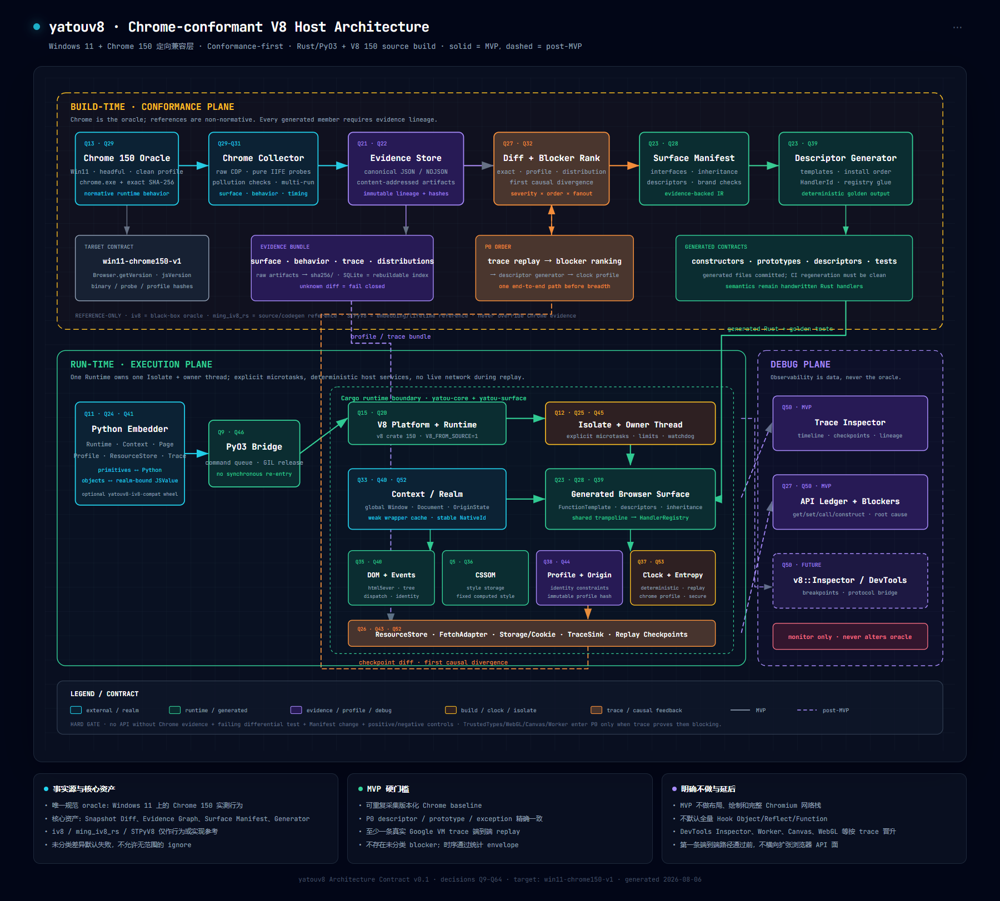

# yatouv8

> 当前状态：M0–M10 已完成，发布版本 `0.1.0`。已验证一条**公开归档的真实
> Google reCAPTCHA BotGuard VM** 路径、Chrome 150 的 M8 宿主语义，以及
> 2026-08-07 当前公开 Google/recaptcha.net loader。当前在线 challenge 与私有
> BotGuard bytecode 仍不在完成声明内。SG_SS 定向本地门禁已达到 12,841/12,841
> descriptor、9,565/9,565 callable metadata 和 0 failure；未经纳入 corpus 的
> 私有 VM 中 `sgs` 初始化不属于该完成声明。当前在线 Google Search challenge 已能
> 生成并在同 session 第二跳消费 SG_SS，但 fresh curl 与 fresh Chrome control 均被
> Google 的后续 `/sorry/` 风险门禁拒绝，因此尚未宣称 SearchResultsPage 在线通过。

`yatouv8` 是面向 Windows 11 + Chrome 150 的证据驱动型 V8 浏览器宿主：先采集 Chrome 行为，再通过差异、因果 blocker、Manifest 和生成器收敛兼容层。



## 当前里程碑

| 里程碑 | 状态 | 完成条件 |
| --- | --- | --- |
| M0 架构合同 | 完成 | 总体图、ADR、Workspace 骨架 |
| M1 V8 substrate | 完成 | V8 150 源码构建并执行最小 JavaScript |
| M2 Chrome evidence | 完成 | headful Chrome 150 基线、重复稳定性与 clock distribution 已验证 |
| M3 Trace spine | 完成 | L0 strict replay、L1 API ledger、NDJSON Schema 与 inspector 已验证 |
| M4 Diff/ranking | 完成 | typed trace diff、checkpoint diff 与因果 blocker ranking 已验证 |
| M5 Surface generator | 完成 | 1,469 surfaces / 12,841 descriptors、lineage 与 L1 trampoline 已生成并验证 |
| M6 首条真实路径 | 完成（归档目标） | Chrome 150 与 yatouv8 的 7/7 BotGuard trace 事件一致，strict replay 全消费 |
| M7 SDK/runtime | 完成 | owner thread、persistent Context、Python SDK、资源注入、GIL 释放与 wheel 测试 |
| M8 Host semantics | 完成 | DOM/CSSOM/Event/Timer/Storage/Cookie/Fetch 最小语义；Chrome/yatouv8 probe 哈希一致 |
| M9 当前公开 corpus | 完成（公开 loader） | google.com 与 recaptcha.net 当前 loader 双侧一致，第二阶段已内容寻址 |
| M10 发布工程 | 完成 | Windows wheel、CI、SBOM、release audit、性能/并发/恢复和终态证据门禁 |

## Python API

构建并验证 CPython 3.10–3.14 Windows wheel：

```powershell
.\scripts\build-wheel.ps1
.\scripts\build-wheel.ps1 -PythonExecutable "D:\language\python-3.10.1\python.exe"
```

使用正式的 persistent runtime：

```python
import yatouv8

with yatouv8.Runtime() as runtime:
    runtime.add_resource(
        "https://fixture.invalid/data.json",
        '{"answer": 42}',
        headers={"content-type": "application/json"},
    )
    print(runtime.eval("6 * 7"))
    runtime.eval(
        "fetch('https://fixture.invalid/data.json')"
        ".then(r => r.json()).then(v => globalThis.answer = v.answer)"
    )
    print(runtime.eval("answer"))
    print(runtime.trace["footer"])
```

`Runtime`/`Context` 把 V8 Isolate 固定在 owner thread；Python 等待时释放 GIL。
`fetch` 只读取显式 `add_resource` 内容，缺失 URL 不回退真实网络。

需要定位 Google VM 的首个环境分叉时，显式开启有界 GET tracing：

```python
import yatouv8

config = yatouv8.RuntimeConfig(
    get_trace=yatouv8.GetTraceConfig(enabled=True, max_events=50_000),
)
with yatouv8.Runtime(config) as runtime:
    runtime.eval("navigator.userAgent; performance.now(); screen.width")
    gets = [
        event["entry"]
        for event in runtime.trace["events"]
        if event["level"] == "l1" and event["entry"]["operation"] == "get"
    ]
    print(gets)
    print(runtime.get_trace_stats)
```

该模式覆盖全局对象、缺失全局属性、DOM/Browser host 嵌套属性、Trusted Types
原生对象，以及 microtask/timer 回调中的读取。GET 与 native CALL 使用共享序号，
因此 trace 保留真实因果顺序。诊断默认关闭；`max_events` 是每个 Runtime 的硬上限。
详细合同见 [GET tracing](docs/evidence/get-tracing.md)。

当 GET trace 已足够、需要进入动态 `eval` 内部定位未执行的初始化分支时，开启
V8 Inspector precise coverage：

```python
import json
import yatouv8

config = yatouv8.RuntimeConfig(
    execution_trace=yatouv8.ExecutionTraceConfig(
        enabled=True,
        capture_source=True,
        max_scripts=256,
        max_source_bytes=1_048_576,
    ),
)
with yatouv8.Runtime(config) as runtime:
    runtime.eval(challenge_source)
    capture = runtime.execution_trace
    blockers = yatouv8.analyze_execution_trace(capture, ("knitsail", "td", "sgs"))

with open("execution-trace.json", "w", encoding="utf-8") as output:
    json.dump({"capture": capture, "blockers": blockers}, output, ensure_ascii=False, indent=2)
```

该模式不替换 `eval`、不改写目标源码；它捕获 entry/nested dynamic script 的精确
源码、SHA-256、函数与 block range 计数，并把位于 zero-count range 内的
`knitsail`/`td`/`sgs` 出现位置排在 blocker 首位。Inspector 诊断默认关闭，不参与
最终 Chrome oracle 验收。完整字段见
[动态 eval execution trace](docs/evidence/execution-tracing.md)。

对完整 Google SG_SS challenge，不要把 `window.sgs !== undefined` 或所有
`undefined` outcome 当作成功门槛。使用
[Google VM 终态谓词](docs/evidence/google-vm-terminal-predicates.md) 验证最终
`knitsail`、`td`、`SG_SS` Cookie 与导航链路。

不扩充 trace、直接比较最可能阻断 `td` 初始化的 API 语义：

```powershell
python tools/semantic-conformance/runner.py `
  --backend all `
  --output .yatou/evidence/semantic-conformance/report.json
```

该 probe 以 Chrome 150 为 oracle，同时运行 `iv8_rs` 和已安装的 `yatouv8`
wheel；动态网络数值与窗口边框差异按不变量归一化，保留类型、brand、descriptor、
稳定身份和方法返回语义。

执行提取出的 SG_SS challenge，并把 Cookie/导航交回同一个 HTTP session：

```python
import yatouv8

config = yatouv8.RuntimeConfig.from_curl_response(
    first_response,
    navigation_start_ms=request_start_ms,
)
with yatouv8.Runtime(config) as runtime:
    runtime.import_cookies(session.cookies)
    result = runtime.eval_challenge(challenge_source)
    runtime.export_cookies(session)
    next_hop = runtime.take_navigation()
```

`result` 同时返回 value、cookies、pending navigation、drain 结果与 trace stats。
在线 oracle 必须保持 GET/Inspector trace 关闭；诊断 Proxy 不能进入 token 生成路径。

执行完整同会话在线硬门禁：

```powershell
py -3.13 tools\google-vm-acceptance\live_runner.py `
  --url "https://www.google.com/search?q=亚非" `
  --proxy "http://127.0.0.1:7890" `
  --attempts 3 `
  --output .yatou\evidence\google-vm-live\google-com-ya-fei-live-acceptance.json
```

只有 HTTP 200、非 `/sorry/`、搜索结果 DOM 和 `SG_SS=0` 四个在线终态同时成立才返回 0。

## 构建 V8 smoke test

前置条件：

- Windows 11 x64
- Visual Studio 2022 C++ toolchain
- Windows SDK 10.0.26100.0 或兼容版本
- Python 3.10–3.14
- Rust 1.97.1

从源码构建并执行 V8 150：

```powershell
.\scripts\build-v8-source.ps1
```

脚本会校验并缓存固定版本的 GN、Ninja、Chromium `libclang`、ICU 数据和
Chromium Rust vendor 源码；成功输出必须包含：

```text
yatouv8 V8 smoke: {"engine":"v8","answer":42,"traceSpine":false}
```

只检查不依赖 V8 的 Workspace 骨架：

```powershell
.\scripts\check.ps1
```

采集隔离的 Chrome 150 headless 验证基线：

```powershell
.\tools\chrome-collector\run.ps1
```

首个已验证运行的记录见 [M2 Chrome evidence](docs/evidence/m2-chrome-evidence.md)。

重现 M3 trace 生成、校验、回放、检查和证据准入：

```powershell
.\scripts\run-m3-spine.ps1
```

M3 的边界与验证结果见 [M3 Trace spine](docs/evidence/m3-trace-spine.md)。

重新生成 M5 Surface Manifest 与 Rust descriptor 表：

```powershell
python tools/surface-codegen/generate.py `
  --snapshot .yatou/evidence/baselines/win11-chrome150.0.7871.188-headful-m2-v3-full/runs/20260808T063559.250211Z-aca4ebfd/snapshot.json `
  --manifest manifests/chrome150.surface.json `
  --rust crates/yatou-surface/src/generated/chrome150.rs `
  --runtime manifests/chrome150.runtime-surface.json
```

本机已有固定 SHA 的 `InsideReCaptcha/model.js` 与 `enc` 后，重现 M6：

```powershell
.\scripts\run-m6.ps1
```

重现 M8–M10：

```powershell
.\scripts\run-m8.ps1
.\scripts\run-m9.ps1
.\scripts\run-m10.ps1
.\scripts\run-sgss-acceptance.ps1
```

## 工程结构

```text
crates/
├── yatou-schema     # Snapshot、Manifest、Profile、Trace 数据合同
├── yatou-core       # Runtime、Isolate、Context、Scheduler
├── yatou-surface    # 生成的浏览器接口和 HandlerRegistry
├── yatou-harness    # Diff、allowance、因果 blocker ranking
└── yatou-py         # PyO3 扩展

tools/
├── chrome-collector # Chrome 150 CDP 采集器
├── google-vm-acceptance # SG_SS 本地谓词与同 session 在线硬门禁
├── google-vm-collector # 真实归档 BotGuard oracle/diagnostic 与 M6 准入
├── google-vm-corpus # 当前公开 loader corpus 与 M9 双侧准入
├── host-conformance # M8 Chrome/yatouv8 同源 probe
├── release          # SBOM、wheel audit 与 M10 终态报告
├── semantic-conformance # td 初始化候选 API 的 Chrome/iv8/yatouv8 三方差分
├── surface-codegen  # Surface Manifest 代码生成器
└── trace-inspector  # Trace/API ledger 检查工具
```

## 核心约束

1. Chrome 150 实测行为是唯一规范 oracle。
2. `iv8`、`ming_iv8_rs` 和 STPyV8 只能作为行为或实现参考。
3. 新接口必须具有 Chrome evidence、失败的 differential test 和 Manifest 记录。
4. 生成器负责结构；DOM、CSSOM、Clock 等语义由 Rust handler 实现。
5. 第一条真实 trace 通过前，不横向扩展 Canvas、WebGL、Worker、Audio 等接口面。
6. Replay 模式禁止回退到真实网络。

## 架构文档

- [总体架构说明](docs/architecture/README.md)
- [交互式 HTML 架构图](docs/architecture/yatouv8-overview.html)
- [架构决策记录](docs/adr/README.md)
- [参考项目与版本](docs/references.yaml)
- [M2 Chrome evidence](docs/evidence/m2-chrome-evidence.md)
- [M3 Trace spine](docs/evidence/m3-trace-spine.md)
- [M4 Trace diff 与 blocker ranking](docs/evidence/m4-trace-diff.md)
- [M5 Surface Manifest 与生成器](docs/evidence/m5-surface-generator.md)
- [M6 归档真实 Google BotGuard 路径](docs/evidence/m6-google-botguard.md)
- [M7 Runtime 与 Python SDK](docs/evidence/m7-runtime-python.md)
- [M8 Host conformance](docs/evidence/m8-host-conformance.md)
- [M9 当前公开 loader corpus](docs/evidence/m9-current-loader-corpus.md)
- [M10 发布与终态门禁](docs/evidence/m10-release.md)
- [SG_SS 定向兼容与最终本地验收](docs/evidence/sgss-readiness.md)

## 许可证

Apache License 2.0。参考项目的源码和发布物保留各自许可证；详见 [NOTICE](NOTICE) 和 [references.yaml](docs/references.yaml)。
