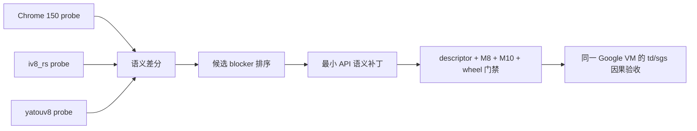

# yatouv8 `td` 初始化候选 API 兼容报告

> 结论：本轮没有继续扩展 trace，而是补齐了 Chrome 150 实测存在、yatouv8
> 原先只有 descriptor 或返回 `null` 的 P0 API 语义。候选 probe 的
> Chrome 150 与 yatouv8 归一化差异为 0；由于仓库中没有产生 `td={}` 的同一份
> Google VM 源码和资源，尚不能把其中某一个 API 宣称为 `td.ns/td.rs` 的唯一因果点，
> 也不声明该私有输入上的 `sgs` 已恢复。

## 验证范围

本轮使用三个独立参照：

| 参照 | 用途 | 规范地位 |
| --- | --- | --- |
| Chrome `150.0.7871.188` | API brand、descriptor、返回值和稳定身份基线 | 唯一 oracle |
| `iv8_rs` | 发现已实现的候选行为和实现路径 | 行为参考 |
| yatouv8 wheel | 验证最终用户安装路径 | 被测实现 |



## 已补齐的语义

| API 族 | 原行为 | 当前行为 |
| --- | --- | --- |
| `navigator.plugins` / `mimeTypes` | 冻结空数组 | Chrome 风格 `PluginArray`、`Plugin`、`MimeTypeArray`、`MimeType`，含索引和命名 descriptor |
| `navigator.permissions` | `null` | `Permissions.query()` 返回 `Promise<PermissionStatus>` |
| `navigator.connection` | `null` | `NetworkInformation`，提供 Chrome 风格网络类型和值域 |
| `screen.orientation` | `null` | `ScreenOrientation`，按 profile 方向返回 type/angle |
| legacy Performance | `timing/navigation/memory` 为 `null`，entries 方法空 stub | 稳定 `PerformanceTiming`、`PerformanceNavigation`、`MemoryInfo` 和 navigation entry |
| `matchMedia` / `visualViewport` | 空 stub / `null` | `MediaQueryList` 和稳定 `VisualViewport` |
| Canvas 2D | `getContext()` 返回 `null`，`toDataURL()` 为 `data:,` | 稳定 `CanvasRenderingContext2D`；WebGL 仍按本机 Chrome 基线返回 `null` |
| `document.hasFocus()` | 空 stub | 返回 `true` |
| `window.chrome` | `{}` | `loadTimes`、`csi`、`app` |

Chrome 150 实测普通页面中 `chrome.runtime` 和 `navigator.userAgentData` 均为
`undefined`，因此没有照搬 iv8_rs 的对应实现。动态创建 DOM 对象在 GET tracing
下还暴露了派生构造函数经过 Proxy 后的 WeakMap receiver 偏差；本轮同时修复了
state lookup，使 trace 开关不再改变 Canvas/DOM 语义。

## 验证结果

| 门禁 | 结果 |
| --- | --- |
| Chrome 150 vs yatouv8 候选 probe | 0 个归一化差异 |
| Chrome 150 vs iv8_rs 候选 probe | 146 个差异；主要包含 iv8_rs 的 WebGL 对象等非 Chrome 基线行为 |
| Runtime descriptor | 12,841 / 12,841 |
| Callable metadata | 9,565 / 9,565 |
| Python wheel tests | 14 / 14 |
| M8 host conformance | conformant，Chrome/yatouv8 哈希一致 |
| M10 release gate | accepted |

最终 wheel：

```text
C:\Users\wuye\Documents\yatouv8\dist\yatouv8-0.1.0-cp313-cp313-win_amd64.whl
SHA256 361e55a145be78e411e63e093bf9db0df2c0a293c29cbb8a7d657d60bcab1982
```

## 复现

```powershell
python tools/semantic-conformance/runner.py `
  --backend all `
  --output .yatou/evidence/semantic-conformance/report.json

.\scripts\run-m10.ps1

python -m pip install --force-reinstall --no-deps `
  .\dist\yatouv8-0.1.0-cp313-cp313-win_amd64.whl
```

本轮证据文件位于：

```text
C:\Users\wuye\Documents\yatouv8\.yatou\evidence\semantic-conformance\report-final.json
C:\Users\wuye\Documents\yatouv8\.yatou\evidence\reports\m10\runs\20260808T081028.974999Z-17ae97b5\m10.report.json
```

## 下一项因果验收

把产生 `iv8_rs: td={"ns":...,"rs":...}`、`yatouv8: td={}` 的同一份入口脚本、
外部 bundle 和初始 Cookie 作为一个 corpus case。随后只比较两个 checkpoint：

1. `td` 从空对象第一次增加 own key 的语句；
2. 该语句前最后一个不同的 API 返回值或异常。

这一步能把当前的“高概率 API 集”收敛为可复现的单个因果 blocker；没有该输入时，
继续横向添加 API 或继续扩大 trace 都不能形成有效证据。
